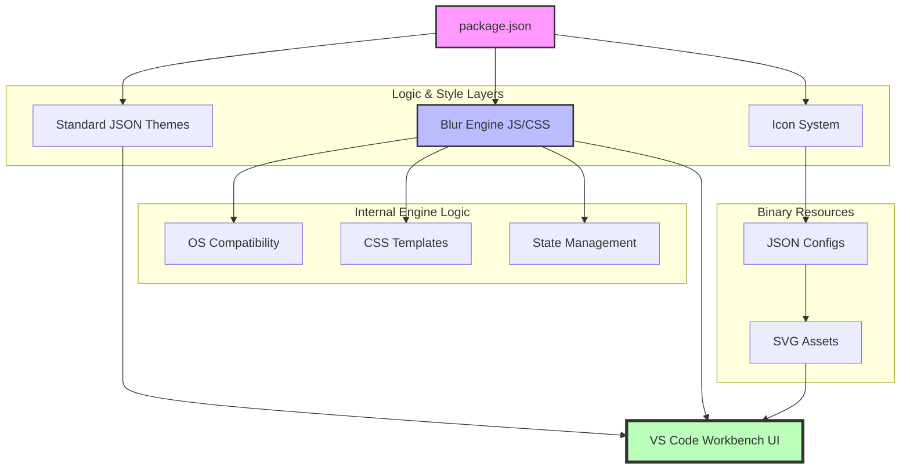

# 🏗️ Lynx Theme Pro Architecture

This document outlines the high-level architecture of **Lynx Theme Pro**, detailing the interaction between its declarative resources and its imperative logic engine.

---

## 📁 System Overview

Lynx Theme Pro is built on a **Hybrid Architecture** that combines standard VS Code theme declarations with a custom JavaScript-driven injection engine.

```text
Lynx-Theme-Pro/
├── 📂 src/
│   ├── 🎨 themes/             # Color definitions & custom logic
│   │   ├── 📄 01-08_*.json    # Theme manifests
│   │   └── 🧪 blur-theme/     # JavaScript Blur Engine
│   ├── 🛠️ icons/              # JSON Icon configurations
│   └── 🖼️ assets/             # SVG/WOFF binary resources
├── 📂 public/                 # Documentation & Media
└── 📄 package.json            # Extension Manifest
```

---

## ⚙️ Core Architecture Layers

| Layer | Responsibility | Components |
| :--- | :--- | :--- |
| **Declarative (JSON)** | Native VS Code integration for themes and icons. | `src/themes/*.json`, `src/icons/*.json` |
| **Imperative (JS)** | Platform detection and dynamic CSS injection. | `src/themes/blur-theme/blur-theme.js` |
| **Resource (Assets)** | Raw visual data for the UI. | `src/assets/svg/`, `src/assets/woff/` |

### 1. The Declarative Core
VS Code's Extension Host natively parses the `.json` files registered in the `contributes` section of `package.json`. These files define the color tokens and icon mappings used across the IDE.

### 2. The Blur Engine (Imperative Logic)
To achieve effects like **Glassmorphism**, which are not natively supported by VS Code's theme API, Lynx Theme Pro uses a custom injection engine.

> [!IMPORTANT]
> The Blur Engine is platform-aware. It identifies the host OS (Linux, macOS, or Windows) to apply specific CSS patches that enable transparency and blur at the window level.

---

## 🗺️ Component Interaction Map


```mermaid
graph TB
    %% Nodes
    Manifest[package.json]
    
    subgraph "Logic & Style Layers"
        Standard[Standard JSON Themes]
        Engine[Blur Engine JS/CSS]
        Icons[Icon System]
    end

    subgraph "Internal Engine Logic"
        direction LR
        Engine --> Platforms[OS Compatibility]
        Engine --> Styles[CSS Templates]
        Engine --> Runtime[State Management]
    end

    subgraph "Binary Resources"
        Icons --> Config[JSON Configs]
        Config --> SVGs[SVG Assets]
    end

    %% Connections
    Manifest --> Standard
    Manifest --> Engine
    Manifest --> Icons

    Standard --> VS[VS Code Workbench UI]
    Engine --> VS
    SVGs --> VS

    %% Styling
    style Manifest fill:#f9f,stroke:#333,stroke-width:2px
    style Engine fill:#bbf,stroke:#333,stroke-width:2px
    style VS fill:#bfb,stroke:#333,stroke-width:4px
```

---

## 🚀 Key Directories & Responsibilities

### `src/themes/`
Contains the definition of the 8 unique themes. The naming convention `01_` to `08_` ensures a logical sorting in the VS Code theme picker. The `blur-theme/` subdirectory contains the logic for platform-specific CSS injection.

### `src/icons/`
Centralizes the mapping of file extensions to the 1280+ SVG assets stored in `src/assets/svg/`. It supports three distinct styles: **Dark**, **Light**, and **Gray**.

### `public/docs/`
A sophisticated, multilingual documentation system that provides a seamless experience for a global audience, supporting 9+ languages with a dynamic cross-linking structure.

---

<sub>Maintained by [Gohit X](https://gohit.xyz) · Licensed under MIT</sub>
