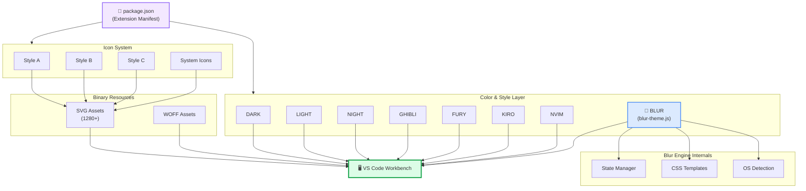

# 🏗️ Lynx Theme Pro — Architecture

This document describes the technical structure of **Lynx Theme Pro**, a VS Code extension that delivers 8 carefully crafted themes, a 1280+ SVG icon pack, and an experimental Glassmorphism blur engine.

---

## 📁 Project Structure

```text
Lynx-Theme-Pro/
├── .vscode/                    # Editor workspace settings
├── src/
│   ├── themes/                 # Theme definitions & blur engine
│   │   ├── 01_dark/
│   │   ├── 02_light/
│   │   ├── 03_night/
│   │   ├── 04_ghibli/
│   │   ├── 05_fury/
│   │   ├── 06_kiro/
│   │   ├── 07_nvim/
│   │   └── blur-theme/         # 🧪 Experimental JS/CSS injection engine
│   │       └── blur-theme.js
│   ├── icons/                  # Icon system (JSON configs)
│   │   ├── a-style/            # Style A — icon mappings
│   │   ├── b-style/            # Style B — icon mappings
│   │   └── c-style/            # Style C — icon mappings
│   └── assets/
│       ├── svg/                # 1280+ SVG icon files
│       └── woff/               # Font assets
├── public/
│   ├── images/                 # Banner, star badge, etc.
│   └── screenshots/            # Theme & icon preview images
│       ├── themes/
│       └── icons/
├── .gitattributes
├── .gitignore
├── .prettierignore
├── .vscodeignore               # Controls what ships in the VSIX bundle
├── ARCHITECTURE.md
├── CHANGELOG.md
├── CODE_OF_CONDUCT.md
├── CONTRIBUTING.md
├── LICENSE                     # MIT
├── icon.png                    # Extension marketplace icon
├── package.json                # Extension manifest & contributes
└── vsc-extension-quickstart.md
```

> **Language breakdown (as of latest release):** JavaScript 91.2% · CSS 8.8%  
> The JS majority comes from the Blur Engine and its CSS injection templates.

---

## ⚙️ Architecture Layers

| Layer | Technology | Responsibility |
| :--- | :--- | :--- |
| **Declarative** | JSON | Native VS Code theme tokens and icon mappings |
| **Imperative** | JavaScript | Platform detection + dynamic CSS injection (Blur Engine) |
| **Styling** | CSS | CSS patch templates applied per operating system |
| **Resources** | SVG / WOFF | Visual assets consumed by the icon system |

---

## 🎨 The 8 Themes

Each theme lives in its own numbered directory under `src/themes/`. The numeric prefix guarantees ordering in the VS Code theme picker.

| # | Theme ID | Type |
| :- | :------- | :--- |
| 1 | **DARK** | Dark |
| 2 | **LIGHT** | Light |
| 3 | **NIGHT** | Dark |
| 4 | **GHIBLI** | Dark |
| 5 | **FURY** | Dark |
| 6 | **KIRO** | Dark |
| 7 | **NVIM** | Dark |
| 8 | **BLUR** 🧪 | Dark + Glassmorphism |

> [!IMPORTANT]
> Theme **8 — BLUR** is currently **experimental**. It relies on the Blur Engine's OS-level CSS injection rather than standard VS Code color tokens, which means it may break after VS Code updates or on unsupported environments.

---

## 🖼️ The Icon System

`src/icons/` maps 1280+ SVG assets (stored in `src/assets/svg/`) to file extensions and VS Code UI regions. It exposes **three visual styles** and a dedicated **System Icons** set.

| Style | Target | Description |
| :---- | :----- | :---------- |
| **System** | IDE chrome | Activity bar, sidebar, explorer icons |
| **A** | File/folder icons | Style variant A |
| **B** | File/folder icons | Style variant B |
| **C** | File/folder icons | Style variant C |

Users choose one style via the VS Code icon theme picker. All styles share the same underlying SVG asset pool.

---

## 🔬 The Blur Engine (Imperative Core)

The Blur Engine is the most complex part of the extension. Because VS Code's theme API has no native support for window-level transparency or blur effects, the engine bridges this gap through **direct CSS injection into the VS Code workbench**.

### Responsibilities

```text
blur-theme.js
├── OS detection          → Identifies Linux / macOS / Windows
├── CSS template loader   → Selects the correct platform patch
├── Runtime injection     → Applies CSS overrides to the active window
└── State management      → Tracks enable/disable state across reloads
```

### Platform strategy

| OS | Mechanism |
| :- | :-------- |
| **macOS** | Vibrancy API via native window flags + CSS `-webkit-backdrop-filter` |
| **Windows** | DWM transparency flags + CSS `backdrop-filter` |
| **Linux** | Compositor-dependent; CSS fallback when compositor unavailable |

> [!WARNING]
> The Blur Engine patches VS Code's workbench HTML directly. This is unsupported by Microsoft and may trigger the "Your VS Code installation appears to be corrupt" warning. This is cosmetic only — the extension functions normally.

---

## 🗺️ Component Interaction Map


```mermaid
graph TB
    Manifest["📄 package.json\n(Extension Manifest)"]

    subgraph Themes["Color & Style Layer"]
        T1[DARK] & T2[LIGHT] & T3[NIGHT] & T4[GHIBLI]
        T5[FURY] & T6[KIRO] & T7[NVIM]
        BlurEngine["🧪 BLUR\n(blur-theme.js)"]
    end

    subgraph IconSystem["Icon System"]
        StyleA[Style A] & StyleB[Style B] & StyleC[Style C]
        SysIcons[System Icons]
    end

    subgraph BlurInternals["Blur Engine Internals"]
        direction LR
        OS[OS Detection]
        CSS[CSS Templates]
        State[State Manager]
    end

    subgraph Assets["Binary Resources"]
        SVGs["SVG Assets\n(1280+)"]
        Fonts["WOFF Assets"]
    end

    Manifest --> Themes
    Manifest --> IconSystem

    BlurEngine --> OS
    BlurEngine --> CSS
    BlurEngine --> State

    StyleA & StyleB & StyleC --> SVGs
    SysIcons --> SVGs

    T1 & T2 & T3 & T4 & T5 & T6 & T7 --> VS["🖥️ VS Code Workbench"]
    BlurEngine --> VS
    SVGs --> VS
    Fonts --> VS

    style Manifest fill:#f3e8ff,stroke:#8b5cf6,stroke-width:2px
    style BlurEngine fill:#dbeafe,stroke:#3b82f6,stroke-width:2px
    style VS fill:#dcfce7,stroke:#16a34a,stroke-width:3px
```

---

## 📦 Package Manifest (`package.json`)

The `package.json` is the single source of truth for what VS Code loads. Key `contributes` sections:

```jsonc
{
  "contributes": {
    "themes": [
      // 8 entries — one per theme directory
    ],
    "iconThemes": [
      // 4 entries — System, A, B, C
    ]
  },
  "activationEvents": [
    // Blur Engine activation hooks
  ]
}
```

The `.vscodeignore` file controls which files are excluded from the published VSIX bundle — `public/` (screenshots, docs) and dev configs are stripped at publish time.

---

## 🌐 Documentation (`public/`)

```text
public/
├── images/         # Marketing assets (banner, badges)
└── screenshots/
    ├── themes/     # One .png per theme variant
    └── icons/      # system.webp, a-style.png, b-style.png, c-style.png
```

Screenshots are referenced directly in the README via GitHub raw URLs and are **not** included in the published VSIX bundle.

---

## 🧩 Complementary Extensions

| Extension | Purpose |
| :-------- | :------ |
| [ATM](https://github.com/bastndev/ATM) | All-in-one toolkit — Error Lens, Git Blame, Env Protection, code screenshots |
| [Lynx Keymap Pro](https://github.com/bastndev/Lynx-Keymap-Pro) | Unified keyboard shortcuts across editors |
| [Compare Code](https://github.com/bastndev/Compare-Code) | Fast, visual side-by-side code diffing |

---

## 📋 Key Design Decisions

**Why numbered theme directories?** The `01_` prefix is not decoration — VS Code sorts theme picker entries alphabetically, so numeric prefixes guarantee the intended display order.

**Why CSS injection instead of the theme API?** VS Code exposes no API for window-level blur. Injecting CSS directly into the workbench is the only known method to achieve true Glassmorphism. The trade-off is instability across VS Code updates.

**Why three icon styles?** Different developers have different aesthetic preferences. Rather than picking one winner, the extension ships three styles that share the same underlying SVG pool, keeping the asset count manageable.

---

<sub>Maintained by [Gohit X](https://gohit.xyz) · Extension ID: `bastndev.lynx-theme` · Licensed under MIT</sub>