# Lynx Theme Pro Architecture

## Overview

**Lynx Theme Pro** is a comprehensive extension for Visual Studio Code that provides multiple color themes and a custom icon system. The extension is designed to enhance the development experience with visually appealing and eye-friendly themes, along with intuitive `icons` for different file and folder types.

## How it Works

When a user activates the **Lynx Theme Pro** extension in VS Code:

1. The `package.json` file registers the themes and icons through the `contributes` field.
2. Based on user settings or interactions, the **Theme Engine** or **Icon Theme Engine** loads the respective JSON configurations.
3. These configurations are interpreted by the VS Code host and applied to the **User Interface**.
4. Supporting files like icons (SVGs) and documentation provide both visual fidelity and development support.

> 💡 **Note on naming conventions:**  
> Color themes use a prefix (`Lynx-`) followed by a sorting letter (`x`, `y`, `z`) to control display order in the VS Code UI. For example:  
> `Lynx-xGhibli-theme.json`, `Lynx-yCoffee-theme.json`, `Lynx-zKiro-theme.json`.

---

## Architecture Diagram

```mermaid
graph TB
    subgraph "📦 Lynx Theme Pro Extension"
        direction TB
        A[package.json<br/>📋 Main Configuration]
        
        subgraph "🔧 Core Structure"
            direction LR
            B[Contributes] --> C[🎨 Themes]
            B --> D[🎯 Icon Themes]
        end
        
        subgraph "🎨 Color Themes Collection"
            direction TB
            E[Lynx-Dark-theme.json<br/>🌙 Dark Theme]
            F[Lynx-Light-theme.json<br/>☀️ Light Theme]
            G[Lynx-Night-theme.json<br/>🌃 Night Theme]
            H[Lynx-xGhibli-theme.json<br/>🌸 Ghibli Theme]
            I[Lynx-yCoffee-theme.json<br/>☕ Coffee Theme]
            J[Lynx-zKiro-theme.json<br/>🤖 Kiro Theme]
        end
        
        subgraph "🎯 Icon System"
            direction TB
            K[lynx-icons.json<br/>📁 Icon Configuration]
            L[assets/icons/<br/>🎨 SVG Collection]
            
            subgraph "📦 Icon Categories"
                direction LR
                M[📄 File Icons<br/>500+ types]
                N[📁 Folder Icons<br/>100+ variants]
                O[🔧 Special Icons<br/>Specialized]
            end
        end
        
        subgraph "📚 Documentation & Resources"
            direction LR
            P[README.md<br/>📖 Documentation]
            Q[CONTRIBUTING.md<br/>🤝 Guide]
            R[assets/images/<br/>🖼️ Resources]
            S[CHANGELOG.md<br/>📝 History]
        end

        subgraph "🛠️ Build & Release"
            direction LR
            T[CI/CD Pipeline<br/>GitHub Actions]
            U[vsce / Release Process]
        end
    end
    
    subgraph "🎯 VS Code Integration Layer"
        direction TB
        V[VS Code Extension Host<br/>🏠 Runtime Environment]
        
        subgraph "⚙️ Engine Systems"
            direction LR
            W[Theme Engine<br/>🎨 Color Processing]
            X[Icon Theme Engine<br/>📁 Icon Processing]
        end
        
        Y[User Interface<br/>👤 Visual Output]
    end
    
    A --> B
    C --> E
    C --> F
    C --> G
    C --> H
    C --> I
    C --> J
    D --> K
    K --> L
    L --> M
    L --> N
    L --> O
    A --> T
    T --> U
    U -.-> S
    V -.-> W
    V -.-> X
    W --> Y
    X --> Y
```

