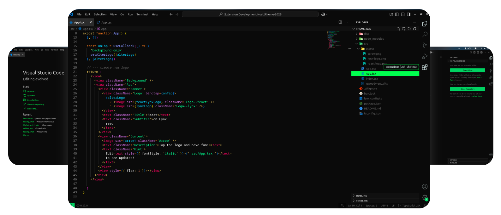

# Lynx Theme [2025](https://lynxjs.org/)

  

# Installation
1. Open your terminal
2. Execute `Lynx Theme`

<!-- ## Manually -->

## Contributors

Here is the project link if you want to collaborate [Lynx-Theme](https://github.com/bastndev/Lynx-Theme).

 |
:---: |
[Gohit bastian](https://www.bastndev.com/) |

## About Me

* [X](https://twitter.com/bastndev) - Best for asking questions and discussing issues.
* [Discord](https://discord.com/invite/bgzvzP6aZH) - Best for hanging out with the community.
* [Youtube](https://www.youtube.com/@bastndev) - For more content about Lynx and programming,

<!-- # License -->
<!--  -->

**Enjoy!**
